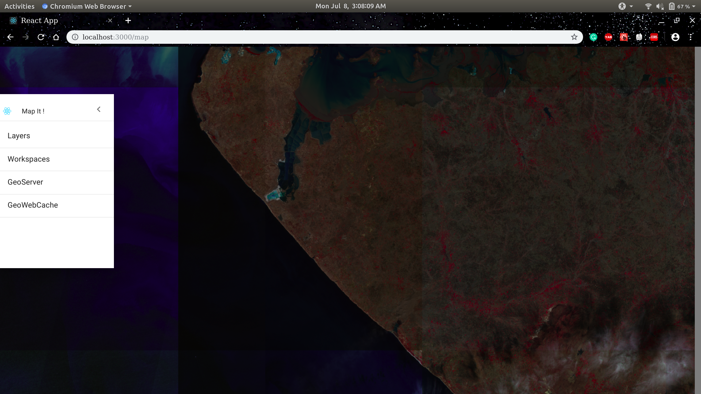
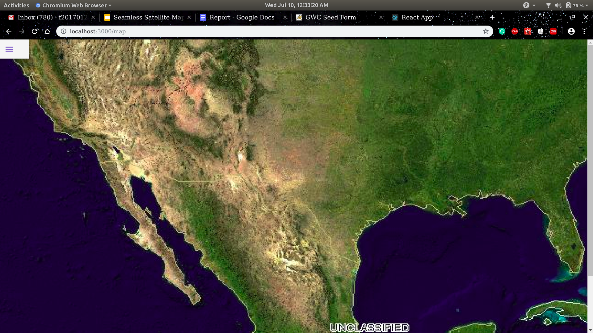

# Map-It !
   

### Introduction
A Seamless Web Mapping Service.

This repository is a part of the ongoing project during my internship at BISAG, Gujarat.

  
   

### Table of Contents

* [Overview](https://github.com/PranjalGupta2199/Map-It/blob/develop/docs/overview.md)
* [Installation]()
    * [Frontend](https://github.com/PranjalGupta2199/Map-It/tree/develop/frontend)
    * [Cache Server]()
    * [Backend](https://github.com/PranjalGupta2199/Map-It/tree/develop/backend)
* [Contribution](https://github.com/PranjalGupta2199/Map-It/blob/develop/docs/contributing.md)
* [License](https://github.com/PranjalGupta2199/Map-It/blob/develop/LICENSE)

### Author
* [Pranjal Gupta](https://github.com/PranjalGupta2199)

Contributions are always welcome! Please read the [contribution guidelines](https://github.com/PranjalGupta2199/Map-It/blob/develop/docs/contributing.md) first.
